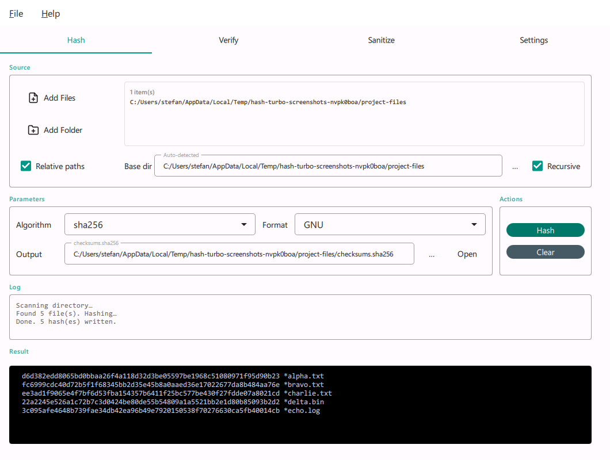
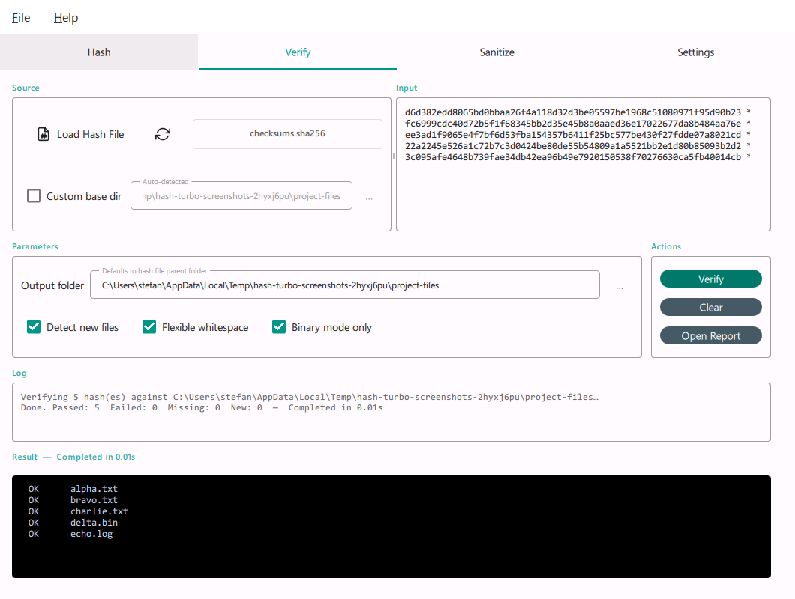
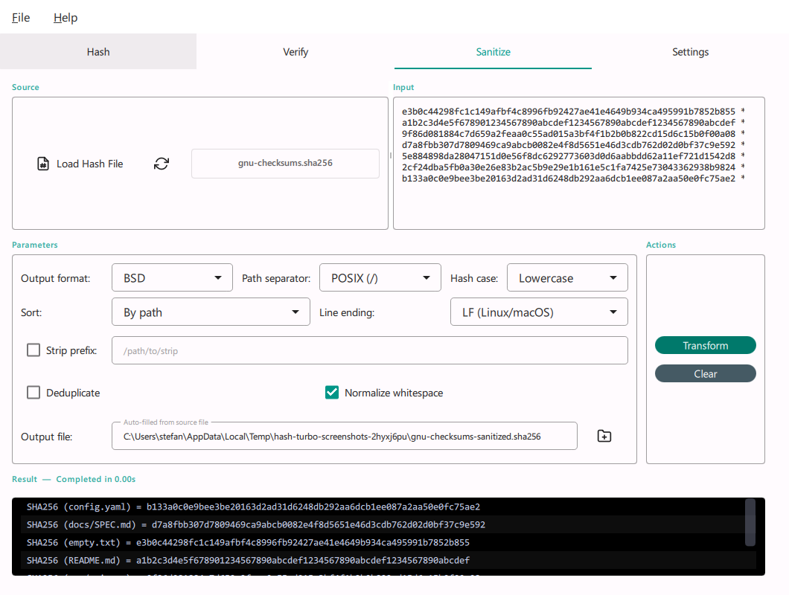
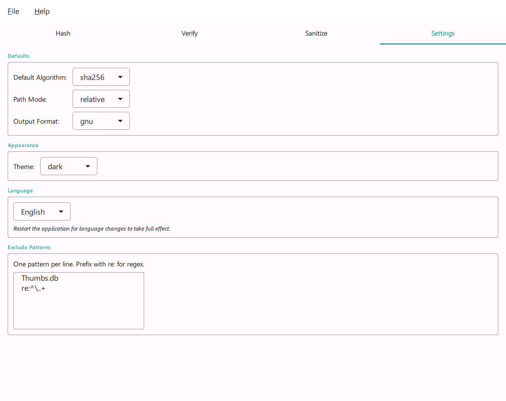

# hash-turbo

> Last updated: 2026-04-21

Cross-platform file hash management tool with CLI and PySide6 QML GUI. Generates, stores, and verifies file hashes with support for many algorithms.

## Installation

```bash
pip install -e .
```

For development:

```bash
pip install -e ".[dev]"
```

## Usage

### CLI

```bash
# Hash a single file (SHA-256 by default)
hash-turbo hash path/to/file.zip

# Hash multiple files
hash-turbo hash file1.txt file2.txt

# Hash a directory recursively
hash-turbo hash src/ --recursive

# Write hashes to a file
hash-turbo hash src/ -r -o checksums.sha256

# Use a different algorithm
hash-turbo hash file.txt -a md5

# BSD format output
hash-turbo hash file.txt --format bsd

# Verify files against a hash file
hash-turbo verify checksums.sha256

# Verify a single file inline
hash-turbo verify file.zip --expect 3a7bd3e2...

# List available algorithms
hash-turbo algorithms

# Sanitize a hash file — convert, normalize, deduplicate
hash-turbo sanitize checksums.sha256 --format bsd --hash-case lower
hash-turbo sanitize checksums.sha256 --strip-prefix C:/projects --separator posix
hash-turbo sanitize checksums.sha256 --deduplicate --sort path -o cleaned.sha256

# Launch the GUI (default when no subcommand given)
hash-turbo gui
hash-turbo
```

### GUI

The GUI provides four tabs:

- **Hash** — Drag-and-drop or browse for files/folders, select an algorithm, toggle recursive scanning, and generate hashes. Results stream to a monospace log panel and are written to a hash file.
- **Verify** — Load a hash file or paste expected hashes, then verify files with visual pass/fail indicators.
- **Sanitize** — Load a hash manifest file and transform it: convert between GNU/BSD formats, normalize path separators (POSIX/Windows), strip path prefixes, normalize hash casing, sort, and deduplicate.
- **Settings** — Configure default algorithm, path mode, output format, theme (system/light/dark), and language (EN, DE, FR, IT, Rumantsch).

| Hash | Verify |
|------|--------|
|  |  |

| Sanitize | Settings |
|----------|----------|
|  |  |

## Development

```bash
# Run tests
pytest

# Type checking
mypy --strict src/

# Build standalone macOS binaries (CLI + .app bundle + DMG)
bash scripts/build_macos.sh
```

This produces the following artifacts in `dist/`:

| Artifact | Purpose |
|----------|---------|
| `hash-turbo` | CLI binary (onefile, console) |
| `hash-turbo.app` | GUI app bundle (onedir — fast startup) |
| `hash-turbo-<version>-macos.dmg` | Distributable DMG |

The GUI uses a PyInstaller **onedir** bundle so Qt/PySide6 libraries live permanently inside `hash-turbo.app/Contents/Frameworks/`. This avoids the per-launch extraction to `/tmp` that onefile mode requires, giving near-instant startup.

## Architecture

```
src/hash_turbo/
├── core/           # Domain logic — zero I/O, pure functions and types
├── cli/            # CLI adapter (click)
├── gui/            # PySide6 QML adapter (Qt Quick / Material)
│   ├── qml/         # QML UI files
│   └── *_model.py   # Python view models exposed to QML
├── i18n/           # Internationalization (gettext, .po/.mo)
└── infra/          # Infrastructure (file scanning, parallelism)
```

## License

hash-turbo is released under the [MIT License](LICENSE).

Third-party dependencies and their licenses are listed in [THIRD-PARTY-LICENSES.md](THIRD-PARTY-LICENSES.md).
